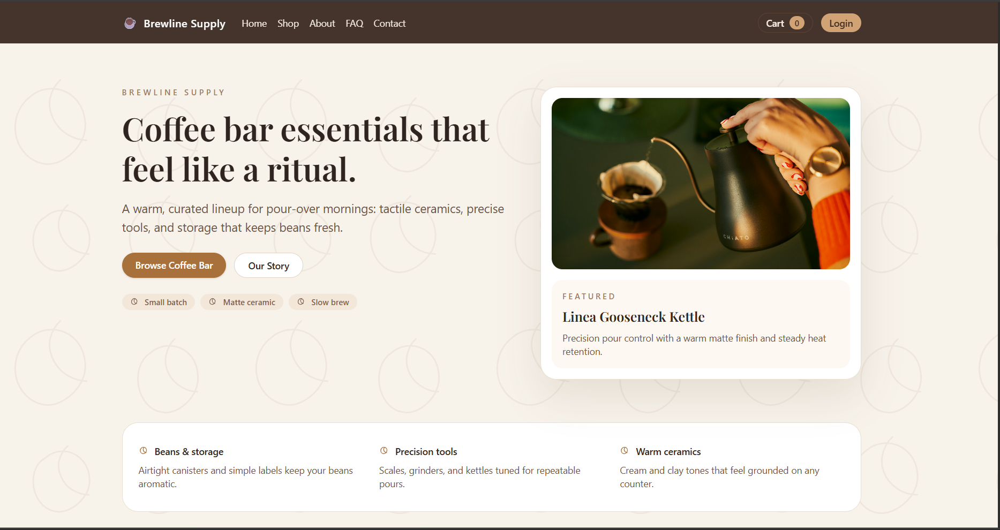
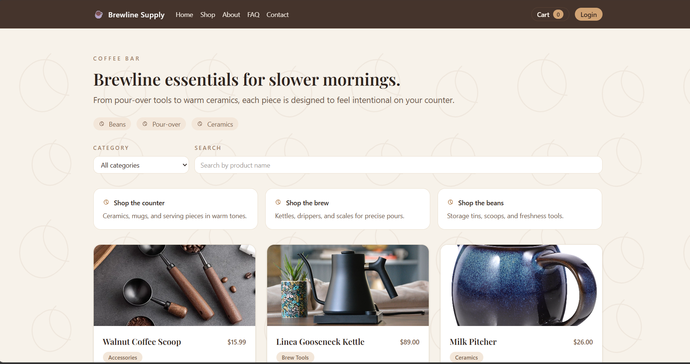

# Brewline Supply — Coffee Bar Showcase

A professional coffee-bar ecommerce showcase built with Next.js, Contentful, and Tailwind CSS. The site includes a product catalog, filtering, cart, and support pages with a warm, minimal brand aesthetic.

**Live site:** https://brewlinesupply.vercel.app/

## Features

- Coffee-bar themed UI with Tailwind CSS
- Product catalog with search, category filter, and pagination
- Product detail pages with highlights and customer notes
- Cart flow + mock checkout + order confirmation page
- Support pages (FAQ, Care Guide, Shipping & Returns, Contact)
- Content managed in Contentful

## Tech Stack

- Next.js (Pages Router)
- Tailwind CSS
- Contentful (content + management)

## Local Setup

Prerequisites:

- Node.js 18+ recommended
- Contentful account + space

Install dependencies:

```bash
npm install
```

Run the development server:

```bash
npm run dev
```

Open [http://localhost:3000](http://localhost:3000).

## Demo Credentials (Local)

Use these for the login page:

- admin@blog.com / admin123
- author@blog.com / author123
- viewer@blog.com / viewer123

## Environment Variables

Create a `.env.local` file in the project root:

```bash
CONTENTFUL_SPACE_ID=your_space_id
CONTENTFUL_DELIVERY_TOKEN=your_delivery_token
CONTENTFUL_MANAGEMENT_TOKEN=your_management_token
JWT_SECRET=your_jwt_secret
```

## Contentful Setup (Quick)

1) Create a Contentful space and environment (`master`).
2) Create a **Product** content type with the required fields below.
3) Add your products and publish them.
4) Add the environment variables in `.env.local`.

## Contentful Model (Product)

Required fields:

- `title` (Short text)
- `description` (Long text)
- `category` (Short text)
- `price` (Number)
- `image` (Asset or URL)

Optional:

- `author` (Short text) — used for permissions

Recommended categories:

- `Brew Tools`
- `Ceramics`
- `Storage`
- `Accessories`

## Pages

- `/` Home
- `/products` Shop
- `/products/[id]` Product detail
- `/cart` Cart
- `/checkout` Mock checkout
- `/checkout-success` Order confirmation
- `/care-guide` Care guide
- `/shipping` Shipping & returns
- `/faq` FAQ
- `/contact` Contact

## Screenshots



## Deployment

Deploy on Vercel or any Node.js hosting provider. Ensure environment variables are set in the hosting platform.

### Vercel Steps

1) Import the GitHub repo in Vercel  
2) Add the environment variables  
3) Deploy  

## Notes

If Contentful Management token is missing or invalid, admin edit/delete will fail. Ensure the CMA token is created under the same organization as the space.
